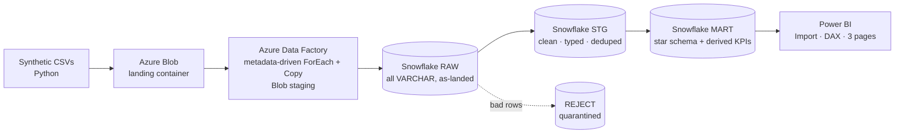
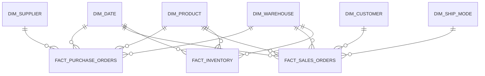

# Supply Chain Analytics — End-to-End Data Pipeline

**Azure Data Factory → Snowflake → Power BI**

An end-to-end supply chain analytics platform for a fictional industrial-components
distributor, **Meridian Industrial Supply Co.** Raw operational data lands as CSV in
Azure Blob Storage, is ingested by a metadata-driven Azure Data Factory pipeline into
Snowflake, cleaned and modelled through a **medallion architecture (RAW → STG → MART)**,
and surfaced in a multi-page Power BI dashboard covering procurement, fulfillment, and
inventory performance.

> Built to demonstrate professional-grade data engineering and analytics across the
> modern ELT stack — ingestion, orchestration, warehouse transformation, dimensional
> modelling, and BI.

---

## Tech Stack

| Layer | Technology |
|---|---|
| Ingestion & Orchestration | **Azure Data Factory** (metadata-driven pipeline, Blob staging) |
| Landing | **Azure Blob Storage** |
| Warehouse & Transformation | **Snowflake** (medallion: RAW / STG / MART, SQL ELT) |
| Semantic Model & BI | **Power BI** (star schema, DAX measures) |
| Data Generation | **Python** (pandas, numpy) |

---

## Architecture



**Medallion layers**

- **RAW** — landed exactly as received, every column `VARCHAR`, so ingestion never fails on dirty data.
- **STG** — cleaned, typed, deduped, and conformed. Invalid rows are **quarantined to a REJECT schema** with a reason, never silently dropped.
- **MART** — star schema of dimension + fact **views**, with row-level business logic (lead time, OTIF flags, fill rate, stockout flags) baked in for Power BI to aggregate.

---

## Repository Structure

```
supply-chain-analytics/
├── README.md
├── sql/
│   ├── 01_snowflake_foundation.sql   # roles, warehouse, DB, medallion schemas, RAW tables
│   ├── 02_transform_stg.sql          # RAW → STG cleaning + REJECT quarantine
│   ├── 03_mart_star_schema.sql       # MART dim/fact views + derived KPI logic
│   └── 04_powerbi_access.sql         # read-only reporting role + grants
├── data_generation/
│   ├── generate_data.py              # synthetic supply-chain data generator
│   ├── dirtyfy.py                    # injects realistic data-quality issues
│   └── DATA_QUALITY_ISSUES.md        # every injected issue → its Snowflake fix
├── data/
│   ├── raw_dirty/                    # 9 landing CSVs (dirty, loaded via ADF)
│   └── clean_reference/              # clean "gold" versions (validation only)
├── adf/
│   └── screenshots/                  # pipeline, linked services, copy activity
├── powerbi/
│   ├── SupplyChain_Analytics.pbix    # the report
│   └── screenshots/                  # dashboard pages
└── docs/
    └── dax_measures.md               # all DAX measures documented
```

---

## Data Model (Star Schema)

Three fact tables radiating out to six conformed dimensions. Date, Product, and
Warehouse are shared (conformed) across facts.



| Fact | Grain | Key measures |
|---|---|---|
| `FACT_PURCHASE_ORDERS` | one PO line | inbound OTIF, lead time, spend |
| `FACT_SALES_ORDERS` | one order line | outbound OTIF, on-time delivery, fill rate, freight |
| `FACT_INVENTORY` | product × warehouse × week | stockout rate, below-reorder, stock value |

---

## Pipeline Walkthrough

### 1. Ingestion — Azure Data Factory
A single **metadata-driven** pipeline (`PL_Load_RAW`) loads all nine source files:
a `ForEach` iterates a file→table mapping array, and one parameterized `Copy` activity
handles every table (no hardcoded per-table copies). The Snowflake connector uses
**Blob staging** (required for its bulk `COPY`), and each load is made **idempotent**
via a pre-copy `TRUNCATE`. A dedicated least-privilege Snowflake service account
(`ADF_SVC`) performs the load.

### 2. Cleaning — Snowflake RAW → STG
The STG layer fixes deliberately-injected data-quality issues and quarantines
unrecoverable rows:

| Load stage | Rows in | Rows out (STG) | Quarantined (REJECT) |
|---|---|---|---|
| Purchase Orders | 8,080 | 7,710 | 290 |
| Sales Orders | 22,176 | 21,297 | ~700 |
| Inventory | 20,471 | 19,098 | ~1,277 |

Techniques: multi-format date parsing (`COALESCE(TRY_TO_DATE(...))`), numeric cleanup
(`REPLACE` + `TRY_TO_NUMBER`), text standardization (`TRIM`/`INITCAP`/`CASE` mapping),
deduplication (`QUALIFY ROW_NUMBER()`), and referential-integrity checks that route
orphan keys and impossible values to `REJECT` with a reason. See
[`data_generation/DATA_QUALITY_ISSUES.md`](data_generation/DATA_QUALITY_ISSUES.md).

### 3. Modelling — Snowflake MART
Dimension and fact **views** form a clean star schema. Row-level business logic is
computed in SQL (e.g. `LEAD_TIME_DAYS`, `IS_OTIF`, `FILL_RATE`, `IS_STOCKOUT`), leaving
aggregation ratios to DAX — the right division of labour between warehouse and BI.

### 4. Visualization — Power BI
Import-mode connection through a read-only role (`BI_READER_ROLE`) on a dedicated
reporting warehouse (`WH_REPORT`). Star-schema relationships, ~20 DAX measures, and
three report pages: **Executive / Sales**, **Procurement & Supplier Performance**,
**Fulfillment & Inventory**.

---

## Key Insights Surfaced

- **Supplier reliability degrades sharply by tier.** Tier-A suppliers hit **84.6% inbound OTIF** with a **10-day** average lead time; tier-C suppliers manage only **35.1% OTIF** at **41 days** — 4× the wait, half the reliability.
- **One warehouse drives most fulfillment problems.** The Hyderabad DC has the network's **highest stockout rate (~38%)**, **lowest on-time delivery (~63%)**, and **lowest stock value** — a single root cause (chronic under-stocking) explaining three downstream symptoms across three fact tables.
- **Demand is seasonal**, with a clear Q4 revenue lift built into the data.

---

## How to Reproduce

1. **Generate data** — `python data_generation/generate_data.py` then `python data_generation/dirtyfy.py` (or use the CSVs in `data/raw_dirty/`).
2. **Snowflake foundation** — run `sql/01_snowflake_foundation.sql`.
3. **Azure** — create a Storage Account, upload the 9 CSVs to a `landing` container, create a `staging` container, generate a SAS.
4. **ADF** — create linked services (Blob via SAS, Snowflake via `ADF_SVC`), two parameterized datasets, and the metadata-driven `ForEach` + `Copy` pipeline with Blob staging enabled; run it.
5. **Transform** — run `sql/02_transform_stg.sql` then `sql/03_mart_star_schema.sql`.
6. **Reporting access** — run `sql/04_powerbi_access.sql`.
7. **Power BI** — connect (Import) to the `MART` schema via `PBI_SVC` / `WH_REPORT` / `BI_READER_ROLE`, build the model + report (or open `powerbi/SupplyChain_Analytics.pbix`).

---

## Skills Demonstrated

- Metadata-driven **ADF** orchestration with parameterization, staging, and idempotent loads
- **Snowflake** medallion ELT: safe casting, multi-format parsing, dedup, referential integrity, quarantine pattern
- Least-privilege **RBAC** (separate service accounts and warehouses for ingestion vs reporting)
- **Dimensional modelling** (star schema, conformed dimensions, row-level vs aggregate logic split)
- **Power BI** semantic modelling, DAX, and dashboard design
